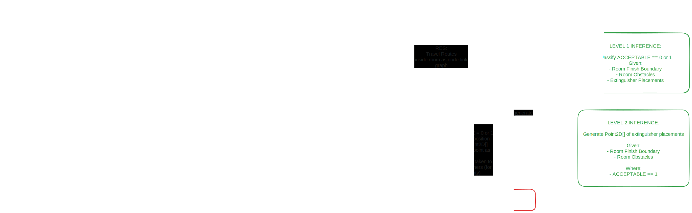

# System Architecture

## Workflows
### 1. Synthetic Data
1. `fire-synth` randomly generate floor plans and columns based on building footprint + random divisions.
1. Pipe footprint and obstacles to `fire-opt`
1. Using rule based methods, iterate through all possible placements for fire extinguishers along walls and structural obstacles.
    1. Evaluate using 1st pass circle based evaluation
    1. Evaluate using 2nd pass travel route based evaluation
1. Using above methods, determine whether placement is acceptable or not.
1. Compile input, layout and evaluation into JSON to form data items that include:
    1. Room Finish Boundary & Room Obstacles (as as 2xM vector)
    1. Extinguisher placement (as 2xN vector)
    1. Extinguisher coverage (as 2xP vector)
    1. Travel route to extinguisher (as 2xL vector)
    1. Compliance (0 for fail, 1 for pass)

### 2. AI Training
1. For each data item, vectorize all paths / boundaries.
2. Apply convolutions:
    1. Extinguisher placements -> Extinguisher coverage
    1. Boundary & Obstacles -> Travel routes
    1. Possibly apply ReLU / MLP?
    1. Extinguisher coverage -> 0 or 1
    1. Travel routes -> 0 or 1
3. Export weights for inference

### User Workflow
1. User opens up plugin in Revit
1. Revit opens dialog which is actually an embedded browser (WebView2)
1. On Extinguisher page, user can press "Infer" to send room boundaries and obstacles to `fire-infer`
1. On backend, `fire-infer` calls `fire-svg` whenever conversions to or from svg is required.
1. Outputs on `fire-infer` are received as response, and results are rendered on WebView2 as SVG.
1. On pressing export in `fire-rvt` the Revit model is populated with the appropriate families.
